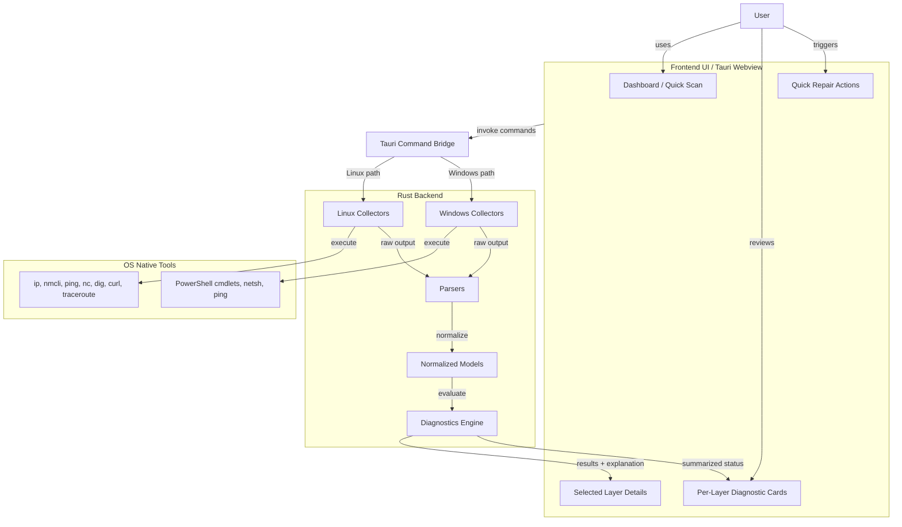

# System Architecture

This diagram shows the high-level structure of the **Network Troubleshooter** application, from the user-facing Tauri frontend down to the OS-native networking tools used for diagnostics.

## Mermaid Diagram

## Explanation

The **frontend UI** is responsible for interaction with the user. It provides the main dashboard, the per-layer summary cards, detailed explanations for the selected layer, and quick repair actions.

The **Tauri command bridge** connects the frontend to the Rust backend. When the user starts a scan or repair action, the frontend invokes backend commands through this bridge.

The **Rust backend** is the core of the application. It contains:
- platform-specific collectors for Linux and Windows
- parsers that convert raw command output into structured data
- normalized models shared across platforms
- a diagnostics engine that evaluates the collected data and determines status, severity, and explanations

The **OS native tools** remain the actual source of networking information. The application does not invent data; it reads and interprets results from trusted system utilities such as `ip`, `nmcli`, `ping`, `dig`, `curl`, `traceroute`, PowerShell networking cmdlets, and `netsh`.

This architecture keeps the project modular:
- the UI stays focused on presentation
- platform-specific logic stays isolated
- shared diagnostic reasoning stays reusable
- future platforms such as macOS can be added more easily
